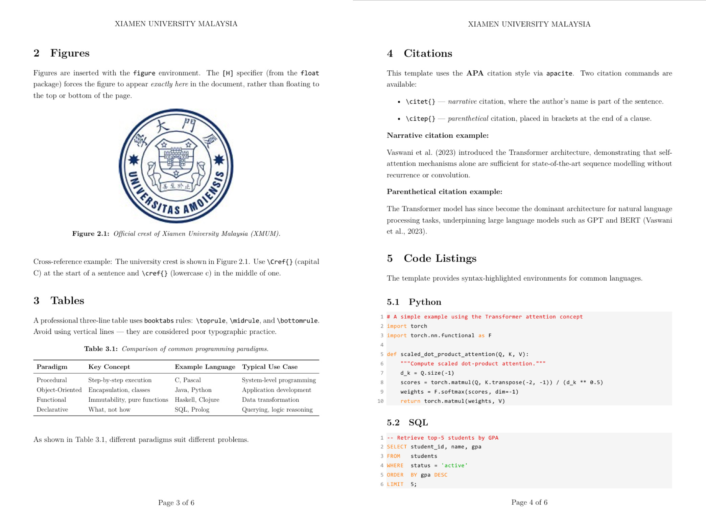

<div align="center">

# XMUM Assignment Template

**A clean, production-ready LaTeX template for English assignments at Xiamen University Malaysia.**

[](LICENSE)
[](https://www.tug.org/xetex/)
[]()

[English](README.md) · [中文说明](README_zh.md)

</div>

---

<p align="center">
  
</p>


Maintained since **May 2025** and battle-tested across a full academic year of XMUM coursework — from short weekly write-ups to a **500+ page** MPU4.1 Community Service Final Report.
Widely adopted by classmates and acknowledged by lecturers for its clean, professional output.

## ✨ Features

| Feature | Detail |
|---|---|
| 📄 Header & Footer | XMUM-style `XIAMEN UNIVERSITY MALAYSIA` header, `Page X of Y` footer |
| 📚 Citations | APA style via `apacite` — `\citet{}` and `\citep{}` |
| 💻 Code Blocks | Syntax-highlighted Python, SQL, JSON, HTML, JavaScript, C++, CMD |
| 🔗 Cross-references | Smart `\cref{}` / `\Cref{}` via `cleveref` |
| 🖼️ Figures & Tables | Per-section numbering (Figure 1.1, Table 2.3, …) with `[H]` float placement |
| 📎 Attachments | One-line `\includepdf` for cover pages, rubrics, and Turnitin reports |
| 🔒 Turnitin Mode | `[turnitin]` class option — removes all headers/footers to prevent false similarity hits |
| 📑 Appendix | Independent Roman numeral page numbering (i, ii, iii…) |

## 🚀 Quick Start

### Prerequisites

- **TeX Live 2022+** (or MiKTeX) with XeLaTeX
- **Consolas** font (pre-installed on Windows; on macOS/Linux, install or substitute in `xmum_asg.cls`)
- Recommended editor: **VS Code** + [LaTeX Workshop](https://marketplace.visualstudio.com/items?itemName=James-Yu.latex-workshop)

### Usage

1. **Clone or download** this repository into your assignment folder:
   ```bash
   git clone https://github.com/YOUR_USERNAME/XMUM_LaTeX_Template.git my-assignment
   ```

2. **Edit `main.tex`** — set your title, author, and student ID.

3. **Write your content** — create `sections/01_introduction.tex`, `sections/02_methodology.tex`, etc. and `\input` them from `main.tex`.

4. **Add references** to `ref.bib` (BibTeX format).

5. **Compile** with XeLaTeX (see [Compilation](#-compilation) below).

## 📁 Project Structure

```
your-assignment/
├── main.tex                 ← Entry point
├── xmum_asg.cls             ← Template class (do not edit unless necessary)
├── ref.bib                  ← BibTeX references
│
├── sections/                ← One .tex file per section (strongly recommended)
│   ├── 01_introduction.tex
│   ├── 02_methodology.tex
│   └── ...
│
├── figure/                  ← All images
│
└── docs/                    ← University documents
    ├── cover_page.pdf       ← Exported from cover_page.docx
    ├── sample_rubric.pdf    ← Marking rubric
    └── turnitin_report.pdf  ← Turnitin report
```

> **Tip — Modular files are AI-friendly.** When you feed one section file at a time to ChatGPT / Claude / Gemini, the AI reads the *complete* section in full, giving higher-quality suggestions without wasting its context window on unrelated content.

## ⚙️ Compilation

> **XeLaTeX is required.** Do not use pdfLaTeX — the template relies on `fontspec` for Consolas.

### With citations (`\bibliography{ref}` present)

```bash
xelatex main
bibtex main
xelatex main
xelatex main
```

### Without citations

```bash
xelatex main
xelatex main
```

In **VS Code** with LaTeX Workshop, set the recipe to `latexmk` — it detects citations automatically and runs the correct number of passes.

## 📤 Turnitin Submission

The repeated `XIAMEN UNIVERSITY MALAYSIA` header and `Page X of Y` footer can inflate your Turnitin similarity score.
Compile a clean version with a **single-word change**:

```latex
% Normal version (for your records and lecturer submission):
\documentclass{xmum_asg}

% Turnitin version (headers/footers completely suppressed):
\documentclass[turnitin]{xmum_asg}
```

See [`sections/best_practices.tex`](sections/best_practices.tex) for the full workflow.

## 🤝 Contributing

Contributions, bug reports, and suggestions are welcome!
Please read [CONTRIBUTING.md](CONTRIBUTING.md) before opening a pull request.

## 📄 License

This project is licensed under the **MIT License** — see [LICENSE](LICENSE) for details.

---

<div align="center">
Made with ❤️ for XMUM students
</div>
